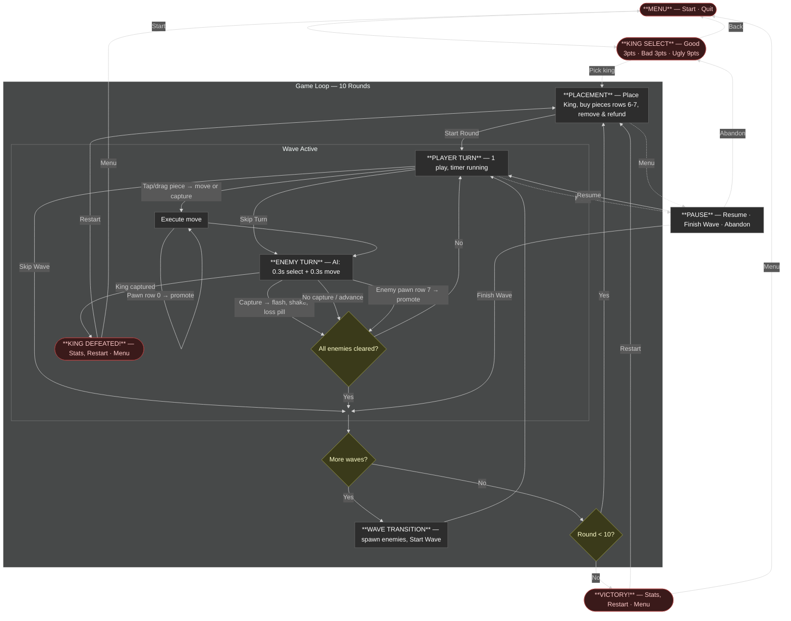

# ChessBrawl — Gameplay Loop

## Game Flow Overview

## Round & Wave Progression

| Round | Waves | New Piece | Peak Composition |
|-------|-------|-----------|------------------|
| 1 | 3 | ♟ Pawn | 4♟ |
| 2 | 3 | ♞ Knight | 4♟ 1♞ |
| 3 | 3 | ♝ Bishop | 4♟ 2♞ 1♝ |
| 4 | 5 | — | 4♟ 2♞ 2♝ |
| 5 | 5 | ♜ Rook | 5♟ 2♞ 2♝ 1♜ |
| 6 | 5 | — | 4♟ 3♞ 2♝ 2♜ |
| 7 | 7 | ♛ Queen | 4♟ 3♞ 2♝ 2♜ 1♛ |
| 8 | 7 | — | 4♟ 2♞ 2♝ 2♜ 2♛ |
| 9 | 7 | — | 3♟ 3♞ 2♝ 2♜ 2♛ |
| 10 | 9 | — | 2♟ 2♞ 2♝ 3♜ 3♛ |

## Piece Economy

| Piece | Symbol | Cost / Capture Reward |
|-------|--------|-----------------------|
| King | ♔ | 0 |
| Pawn | ♟ | 1 |
| Knight | ♞ | 3 |
| Bishop | ♝ | 3 |
| Rook | ♜ | 5 |
| Queen | ♛ | 9 |

- **Starting points:** 3 (or 9 with Ugly king)
- Points are spent to place pieces and earned by capturing enemies.
- Captured enemy piece cost is added back to the player's score.

## Grid Layout

- **6 columns × 8 rows**
- **Rows 0–1:** Enemy spawn zone
- **Rows 6–7:** Player placement zone
- Pieces move using standard chess rules (pawns move upward for player, downward for enemy).

## Key Mechanics

- **Pawn promotion:** When a pawn reaches the opposite end (row 0 for player, row 7 for enemy), it auto-promotes to a Knight or Rook (random) and respawns in its owner's starting zone.
- **Spawn capture:** If enemies spawn on a cell occupied by a player piece, that piece is lost.
- **Turn structure:** Player gets 1 move per turn, then the enemy AI gets 1 move. This alternates until the wave ends.
- **Wave end:** A wave ends when all enemies in that wave are captured (or the player uses Skip Wave).
- **Game over:** The game ends immediately if the King is captured (by enemy move or enemy spawn).
